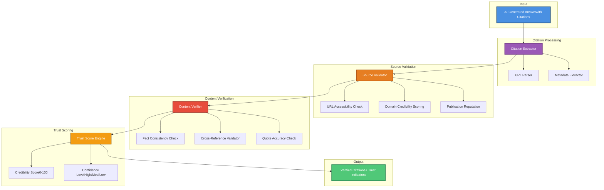

🔍 AI Citation Analyzer

> Research tool for analyzing quality and trustworthiness of AI-generated citations and sources

Built for **Perplexity AI Research Residency** application | Research by Rohit Sharma

---

## 🎯 Problem Statement

When AI systems retrieve and present information, users face a critical challenge:

**How do you verify the accuracy and trustworthiness of AI-generated citations without manually re-doing the entire research?**

This becomes especially **critical** in high-stakes contexts:
- Business decisions based on AI research
- Financial analysis using AI-powered information retrieval
- Technical documentation generated by AI systems
- Academic research assisted by AI tools

---

## 💡 Research Question

**"How can we build automated trust layers for AI-generated citations that maintain accuracy while preserving the speed benefits of AI-powered information retrieval?"**

This research explores:
1. Source credibility scoring algorithms
2. Citation accuracy verification pipelines
3. Cross-reference validation systems
4. Trust indicator design for user interfaces

---

## 🏗️ System Architecture

## 🔬 Research Methodology

### Phase 1: Citation Extraction & Parsing
- Extract citations from AI responses
- Parse source URLs and metadata
- Identify citation patterns across different AI models

### Phase 2: Source Credibility Scoring
Scoring algorithm based on:
- Domain authority metrics
- Publication reputation
- Author credentials
- Peer review status
- Update recency

### Phase 3: Content Verification
- Fact consistency checking
- Cross-reference validation with multiple sources
- Quote accuracy verification
- Context preservation analysis

### Phase 4: Trust Indicator Design
- User interface for trust visualization
- Real-time confidence scoring
- Actionable verification suggestions

---

## 🛠️ Tech Stack

**Core Pipeline:**
- **Python 3.9+** - Main analysis engine
- **BeautifulSoup4** - Web scraping and source validation
- **OpenRouter API** - Cross-verification with multiple LLMs
- **spaCy** - Natural language processing

**Analysis & Scoring:**
- **scikit-learn** - Credibility scoring models
- **pandas** - Data processing
- **numpy** - Numerical operations

**Visualization:**
- **React + Vite** - Dashboard interface
- **Chart.js** - Trust score visualization
- **Tailwind CSS** - Modern UI

**Infrastructure:**
- **FastAPI** - Backend API
- **SQLite/PostgreSQL** - Citation database
- **Docker** - Containerization

---

## 📊 Research Dataset

Building a comprehensive dataset of:
- 1000+ AI-generated answers from multiple models
- 5000+ citations across various domains
- Source credibility ground truth data
- User trust perception surveys

---

## 🎯 Expected Outcomes

### 1. Working Prototype
Functional citation analyzer with:
- Automated source validation
- Trust score generation
- Visual dashboard

### 2. Research Findings
Publishable insights on:
- Citation patterns in AI systems
- User trust factors
- Effective verification strategies

### 3. Open Source Contribution
- Public dataset of verified citations
- Reusable trust scoring algorithms
- Integration examples for AI applications

### 4. Deployment at Scale
System design for:
- Real-time citation verification
- High-volume processing
- API integration for AI platforms

---

## 🚀 Current Status

**Phase:** Active Research & Development

**Completed:**
- ✅ Problem formulation
- ✅ Architecture design
- ✅ Tech stack selection
- ✅ Initial research plan

**In Progress:**
- 🔄 Citation extraction module
- 🔄 Source credibility database
- 🔄 Prototype UI development

**Upcoming:**
- ⏳ User study design
- ⏳ Large-scale testing
- ⏳ Research paper preparation

---

## 📚 Real-World Applications

### For Perplexity AI:
This research directly supports Perplexity's mission of making information universally accessible and useful by:
- Building trust in AI-generated answers
- Enabling high-stakes use cases (business, medical, legal)
- Improving citation quality at scale
- Creating user-facing trust indicators

### For WebBrandify:
Applied in production systems:
- AI Outreach Engine - verifying lead research accuracy
- Website Redesign Workflow - validating design research
- SEO Automation - ensuring content source credibility

---

## 🔗 Related Work

**Research Context:**
- Information retrieval quality assessment
- Credibility scoring in web search
- Human trust in AI systems
- Explainable AI for information access

**Perplexity's Research:**
- DRACO benchmark for deep research accuracy
- Multi-step reasoning in answer engines
- Source diversity in information retrieval

---

## 🎓 Research Goals for Perplexity Residency

If selected for Perplexity AI Research Residency, I aim to:

1. **Scale this research** to Perplexity's production environment
2. **Collaborate** with researchers on trust layer implementation
3. **Publish findings** at top-tier AI/HCI conferences
4. **Open-source** reusable components for the research community
5. **Deploy** practical trust indicators for millions of users

---

## 👨‍💻 About the Researcher

**Rohit Sharma** | AI Systems Builder  
Founder @ WebBrandify

Building AI-powered automation systems serving real businesses. Experienced in:
- Multi-agent AI orchestration (n8n + OpenRouter + Claude API)
- Production AI deployments
- Human-AI interaction at scale
- Growth automation systems

**Why This Research:**  
Through building AI systems for real users, I've seen firsthand how trust issues limit AI adoption in high-stakes contexts. This research bridges my product experience with academic rigor to solve a practical problem at scale.

---

## 📫 Contact

- **Portfolio:** [webbrandify.com](https://webbrandify.com)
- **GitHub:** [@your-username](https://github.com/your-username)
- **LinkedIn:** [Rohit Sharma](https://linkedin.com/in/rohit-sharma-webbrandify)
- **Email:** rohit@webbrandify.com

---

## 📄 License

MIT License - See [LICENSE](LICENSE) for details

---

## 🙏 Acknowledgments

This research is built on insights from:
- Building production AI systems at WebBrandify
- Studying Perplexity's approach to citation quality
- Research on trust in AI-generated content
- Real-world user feedback on AI reliability

---

**🔬 Active Research | 🚀 Applying to Perplexity AI Residency | 🌟 Open for Collaboration**

*"Building trust layers for AI systems that serve millions"*
